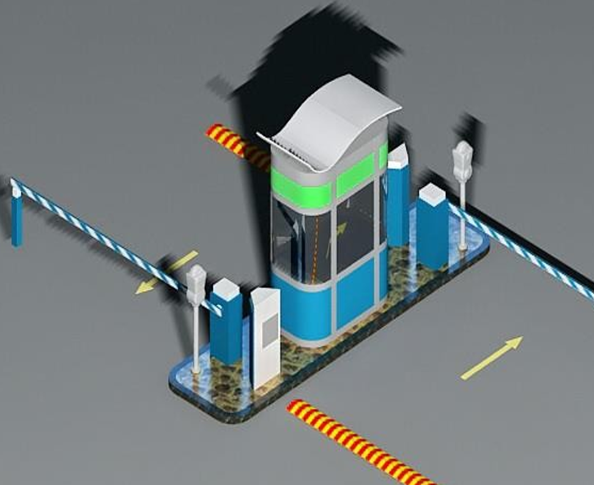
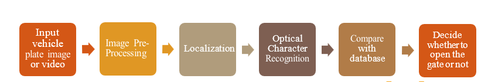
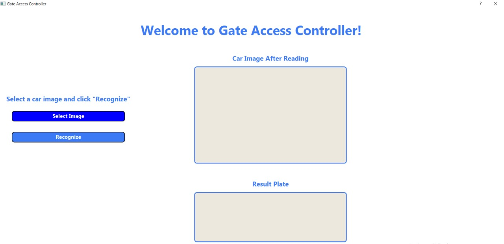
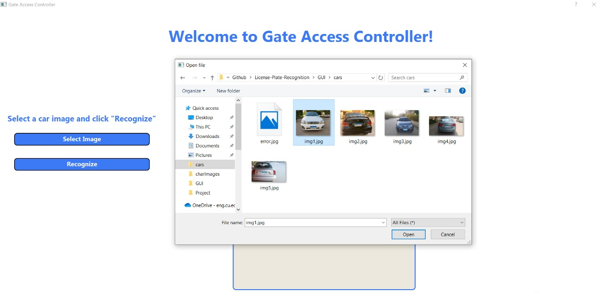
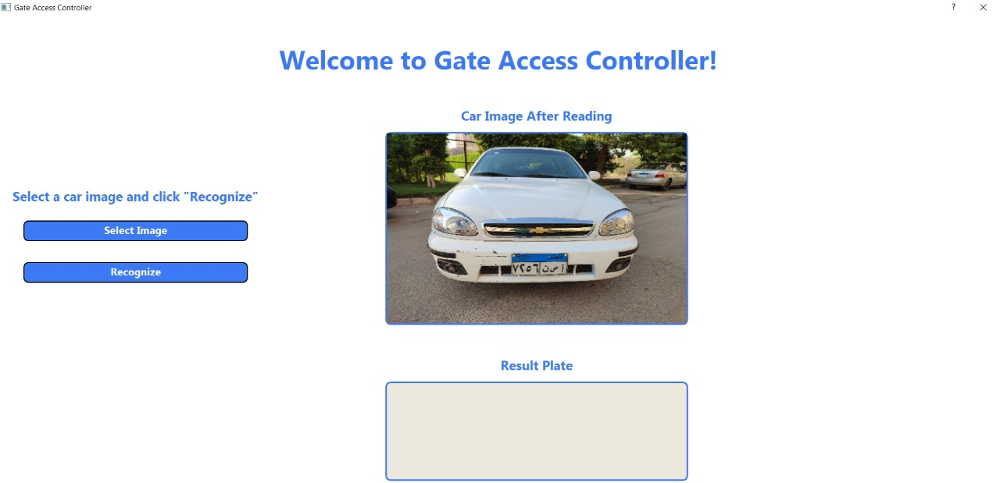
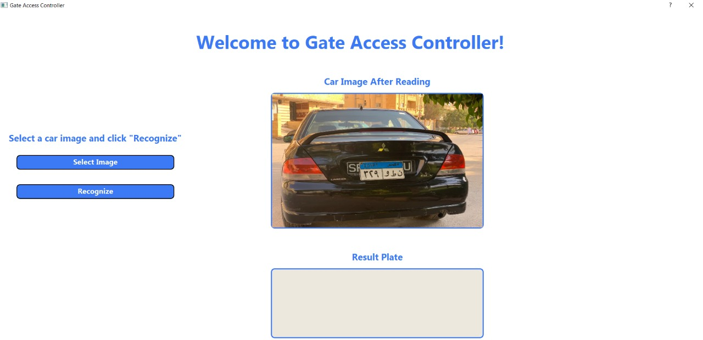
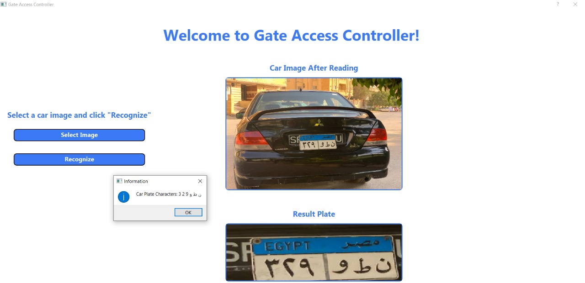

# License plate recognition

<h2>Description</h2>
<blockquote style="font-size: 15px; font-weight: 500">
  

  Our project is <strong>Gate Access Controller</strong>: A gate is open for specific cars based on their plate number, by capturing photographic images from license plates and transforming the optical data into digital information and taking a decision.
 

</blockquote>

<h2>Diagram<h2>

<h2>Detailed Flow-Chart</h2>
<ul>
    <li>Take input (image or video).</li>
    <li>Applying Edge Detection.</li>
    <li>Binarization.</li>
    <li>Filteration and Extraction.</li>
    <li>Check whether there is any License Plate or not</li>
    <li>If Yes: do morphological processing, if No: take new input</li>
    <li>License Plate Recognition and compare with database</li>
    <li>If License Plate matched open the gate if not do nothing</li>
</ul>

<h2>Image processing Algorithms applied</h2>
<ul>
    <li>Thresholding</li>
    <li>Segmentation</li>
    <li>Smoothing</li>
    <li>
        

            <h4>Morphological operations</h4>
            <ul>
                <li>Dilation</li>
                <li>Erosion</li>
                <li>Opening</li>
                <li>Closing</li>
            </ul>
        

    </li>
    <li>Template matching</li>
</ul>

<h2>Build With : </h2>
 <ul>
  <li><a href="https://www.python.org/">Python 3.9</a></li>
  <li><a href="https://jupyter.org/">Jupyter Notebook</a></li>
  <li><a href="https://numpy.org/">Numpy</a></li>
  <li><a href="https://build-system.fman.io/pyqt5-tutorial">PyQt5</a></li>
  <li><a href="https://opencv.org/">OpenCv</a></li>
  <li><a href="https://scikit-image.org/docs/stable/api/skimage.html">Skimage</a></li>
  <li><a href="https://pypi.org/project/imutils/">Imutils</a></li>
  <li><a href="https://matplotlib.org/">Matplotlib</a></li>
  <li><a href="https://docs.python.org/3/library/functools.html">functools</a></li>
 </ul>

<h2>Getting Started</h2>
<blockquote style="font-size: 13px; font-weight: 500">
  
This is an list of needed instructions to set up your project locally, to get a local copy up and running follow these instructuins.
 

</blockquote>
<h2 href="#Installation">Installation</h2>
<ol>
  <li><strong><em>Clone the repository</em></strong>
    

        <code>$ git clone git@github.com:MoazHassan2022/License-Plate-Recognition.git</code>
    

  </li>
  <li> 
  <strong><em>Navigate to repository directory
</em></strong>
    

        <code>$ cd License-Plate-Recognition/</code>
    

  </li>
  <li> 
  <strong><em>Install dependencies
</em></strong>
    

        <code>$ pip install numpy</code>
    

    

        <code>$ pip install PyQt5</code>
    

    

        <code>$ pip install opencv-python</code>
    

    

        <code>$ python -m pip install -U scikit-image
</code>
    

    

        <code>$ pip install imutils</code>
    

    

        <code>$ python -m pip install -U matplotlib</code>
    

  </li>
</ol>

<h2 href="#Running">Running The GUI</h2>
<ul>
  <li><strong><em>Open IDE that supports python(recommended: <a href="https://www.jetbrains.com/help/pycharm/installation-guide.html">Pycharm</a>)</em></strong>
  </li>
    <li><strong><em>Do not forget to install the required packgaes & libraries</em></strong>
  </li>
      <li><strong><em>Run the application.py</em></strong>
  </li>
</ul>

<h2 href="#Running">Running From Jupyter</h2>
<ul>
    <li><strong><em>Open the terminal and the following code</em></strong>
    

        <code>$ cd Jupyter && jupyter notebook</code>
    

  </li>
</ul>

<h2 href="#EditDesign">Editing Design</h2>
<ol>
  <li><strong><em>Install QT tools</em></strong>
       <blockquote>$pip install pyqt5-tools</blockquote>
  </li>
    <li><strong><em>Start the designer</em></strong>
    <blockquote>$designer</blockquote>
  </li>
 
</ol>

<h2 style="text-transform: uppercase;">EXPERIMENT RESULTS AND ANALYSIS</h2>

    <ul>
        <li>
        
<strong><em>Results and analysis regarding the plate detection</em></strong>

        

            <blockquote>
                We managed to detect the plate from 62 images out of 66 images  success rate =94%.  
            </blockquote>
        

        </li>
        <li>
        
<strong><em>Results and analysis regarding characters recognition</em></strong>

        

            <blockquote>
                37 error images from 80 images 
                The success rate = 53.75%.  
            </blockquote>
        

        </li>
                <li>
        
<strong><em>Overall results</em></strong>

        

            <blockquote>
                The success rate = 43.54%.
            </blockquote>
        

        </li>
    </ul>
    

<h2 href="#Screenshots">Screenshots</h2>
<ol>
<li>
  <h4>Program Interface</h4>
  
 </li>

 <li>
  <h4>Select image</h4>
  
 </li>
 <li>
  <h4>After Select</h4>
  
 </li>
 
 <li> 
 <h4>Characters Recognition</h4> 
  
 </li>
 
  <li> 
 <h4>Accepted Car</h4> 
  
 </li>

 <li>
  <h4>Another Car</h4>
  
 </li>

  <li>
  <h4>Characters Recognition</h4>
  
 </li>

   <li>
  <h4>Rejected Car (Do not have access regarding to the database)</h4>
  
 </li>
</ol>
